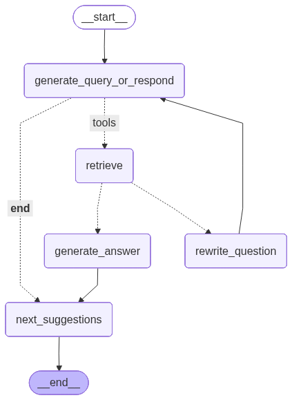

# CCC Chatbot API

## 🚀 Overview

Welcome to the **CCC Chatbot API**, an intelligent conversational backend built using **LangGraph** with advanced reasoning, memory, and retrieval capabilities.

This API powers the CCC Intelligent Chatbot and supports:

* Multi-turn conversations with persistent memory (checkpointer)
* Retrieval-Augmented Generation (RAG)
* Web search and custom tool execution
* Automatic query rewriting and intent clarification
* Context relevance grading before answering
* Tool routing with graceful fallbacks
* Real-time streaming for debugging and observability

---

## 🧭 How the Graph Works

The chatbot is orchestrated using a LangGraph-based execution flow. Each user query passes through multiple intelligent nodes such as:

* **Query Rewriting** – Improves unclear or incomplete questions
* **Relevance Grading** – Determines whether context is sufficient
* **Tool Selection** – Routes the query to RAG, web, or custom tools
* **Answer Generation** – Produces a grounded, concise response
* **Suggestion Generation** – Proposes follow-up questions

> 📌 **Visual Flow**



---

## 📚 API Endpoints

### 🔹 `GET /docs`

Interactive API documentation powered by Swagger UI.

---

### 🔹 `POST /chat`

**Type:** REST
**Purpose:** Standard chatbot interaction (recommended for frontend usage)

**Request Body:**

```json
{
  "query": "string (required)",
  "thread_id": "string (optional, used for memory)"
}
```

**Response:**

* Final AI-generated answer
* `thread_id` for continuing the conversation

---

### 🔹 `POST /chat/stream`

**Type:** SSE (Server-Sent Events)
**Purpose:** Streams node-by-node execution and partial responses (developer/debug mode)

**Use cases:**

* Observing LangGraph node execution
* Debugging tool routing decisions
* Building real-time UIs

---

### 🔹 `POST /suggest`

**Purpose:** Generates follow-up query suggestions based on the final answer

**Request Body:**

```json
{
  "final_answer": "string (optional, uses last AI answer if omitted)",
  "thread_id": "string (optional, used to fetch last AI answer)"
}
```

---

### 🔹 `GET /health`

Health check endpoint for monitoring, orchestration, and deployments.

---

## 🧠 Chatbot Capabilities

* Multi-turn conversational memory
* Automatic question rewriting for ambiguous queries
* Context relevance grading before answering
* Tool-aware reasoning (RAG, web, code, and domain tools)
* Graceful fallback handling when information is unavailable
* Streaming and non-streaming response modes

---

## 🛠️ Available Tools

| Tool Name               | Description                                            |
| ----------------------- | ------------------------------------------------------ |
| `get_weather`           | Fetches real-time weather information for a city       |
| `web_search`            | Performs general web search for up-to-date information |
| `tavily_search`         | High-quality AI-optimized web search                   |
| `code_executor`         | Safely executes code snippets and returns output       |
| `retrieve_info_tool`    | Retrieves general CCC society information              |
| `retrieve_domains_tool` | Fetches CCC technical domains and details              |
| `retrieve_events_tool`  | Retrieves past and upcoming CCC events                 |
| `retrieve_faqs_tool`    | Answers frequently asked CCC-related questions         |
| `retrieve_members_tool` | Fetches CCC members and alumni information             |
| `retrieve_faculty_tool` | Retrieves faculty coordinators and mentors             |

---

## 📦 Dependency Management (uv)

### Generate a locked `requirements.txt` from `pyproject.toml`

```bash
uv pip compile pyproject.toml -o requirements.txt
```

### Install dependencies using `requirements.txt`

```bash
uv pip install -r requirements.txt
```

### Add packages from `requirements.txt` back into `pyproject.toml`

```bash
uv add -r requirements.txt
```

### Useful `uv` Commands

* `uv venv` – Create a virtual environment
* `uv add <package>` – Add a single package
* `uv pip install` – Install packages (pip-compatible)
* `uv sync` – Install dependencies from lock file
* `uv pip compile` – Compile dependencies into a lock file
* `uv pip freeze` – Generate a requirements file

---

## 🧪 Local Deployment

Run the server locally from the project root:

```bash
uvicorn src.server:app
```

Access:

* [http://localhost:8000/docs](http://localhost:8000/docs)
* [http://localhost:8000/health](http://localhost:8000/health)

---

## 🚢 Deployment Guide (Docker)

### 1️⃣ Generate `requirements.txt`

```bash
pip freeze > requirements.txt
```

---

### 2️⃣ Build Docker Image

```bash
docker build -t anurag181/ccc-ragbot:v1 .
```

---

### 3️⃣ Login to Docker Hub

```bash
docker login
```

---

### 4️⃣ Run Docker Container

```bash
docker run -d -p 8000:8000 --env-file .env --name ccc-ragbot anurag181/ccc-ragbot:v1
```

---

### 5️⃣ Verify Deployment

```bash
docker ps
docker logs ccc-ragbot
```

---

### 6️⃣ Push Image to Docker Hub

```bash
docker push anurag181/ccc-ragbot:v1
```

---

## ☁️ Deployment on AWS EC2 (Production)

### 1️⃣ Create an EC2 Instance

* OS: **Ubuntu 22.04 LTS**
* Instance type: `t2.micro` or higher
* Allow **SSH (22)** during setup
* Attach a key pair

---

### 2️⃣ Connect to EC2

```bash
ssh -i your-key.pem ubuntu@<EC2_PUBLIC_IP>
```

---

### 3️⃣ Install Docker

```bash
sudo apt-get update
sudo apt-get install -y docker.io
sudo systemctl start docker
sudo systemctl enable docker
sudo usermod -aG docker $USER
exit
```

➡️ Reconnect after logout.

---

### 4️⃣ Pull Docker Image

```bash
docker pull anurag181/ccc-ragbot:v4
```

---

### 5️⃣ Create `.env` File

```bash
nano .env
```

Paste environment variables and save (`Ctrl+O`, Enter, `Ctrl+X`).

Verify:

```bash
ls -la .env
cat .env
```

---

### 6️⃣ Run Container

```bash
docker run -d \
  -p 8000:8000 \
  --env-file .env \
  --name ccc-ragbot \
  anurag181/ccc-ragbot:v4
```

---

### 7️⃣ Verify

```bash
docker ps
docker logs ccc-ragbot
```

---

### 8️⃣ Update Security Group

Add inbound rule:

| Type       | Protocol | Port | Source    |
| ---------- | -------- | ---- | --------- |
| Custom TCP | TCP      | 8000 | 0.0.0.0/0 |

---

### 🔗 Access

* `http://<EC2_PUBLIC_IP>:8000/docs`
* `http://<EC2_PUBLIC_IP>:8000/health`

---

## ✅ Status

Production-ready, scalable, and suitable for both frontend integrations and developer debugging workflows.

---

Happy building 🚀
